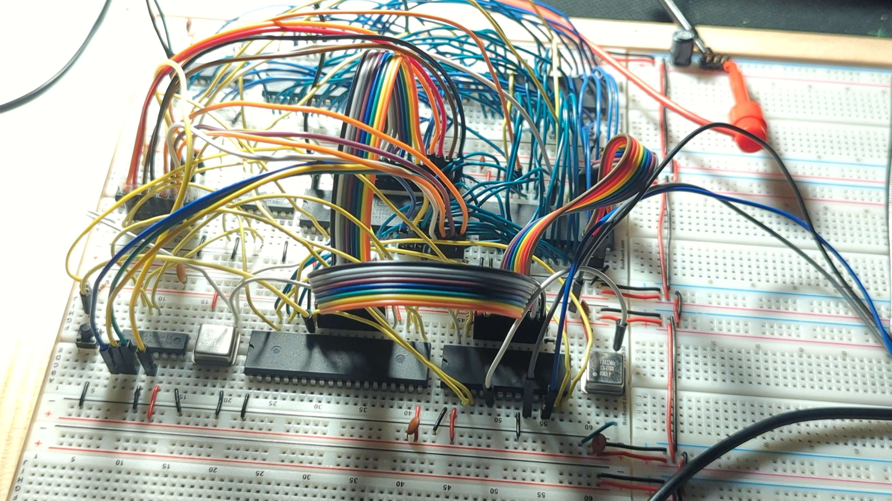

# 6502 Memory Banking



I have been spending too much time mulling over how to get an elegant memory
banking scheme for a 6502 project.  In the end I took inspiration from the
Commander X16 project.  The Commander X16 has the following memory layout:

|ADDRESS  |SIZE |FUNCTION
|---      |---  |---
|0000-9EFF|~39KB|Static Low RAM
|9F00-9FFF|256B |IO Address Space
|A000-BFFF|8KB  |BANKED RAM
|C000-FFFF|8KB  |BANKED ROM

[https://www.c64-wiki.com/wiki/Commander_X16#Memory_and_Operating_System](https://www.c64-wiki.com/wiki/Commander_X16#Memory_and_Operating_System)

The Commander X16 has an elegant solution that maps Zeropage Address $00 and 
$01 to the memory bank latches for RAM and ROM. (I chose to not do this)

My breadboard computer has this exact memory layout.  I chose to decode the memory
with an ATMEL 22v10 PLD.  The logic for the PLD is below:

```text
Name     6502-ROM-BANK-3 ;
PartNo   00 ;
Date     21/08/2023 ;
Revision 01 ;
Designer Engineer ;
Company  productiondave ;
Assembly None ;
Location  ;
Device   g22v10 ;

/* Input */
Pin 1        = PHI2;
Pin 2        = RW;
Pin [3..10]  = [A15..A8];
Pin 11       = ACIAIRQB;
Pin 13       = VIAIRQB;

/* Output */
Pin 15 = MEMWE;
Pin 16 = MEMOE;
Pin 17 = IOCS;
Pin 18 = LOWRAMEN;
Pin 19 = HIRAMEN;
Pin 20 = ROMEN;
Pin 23 = IRQB;

/*  Logic */
!ROMEN		= A15 & A14;
!HIRAMEN        = A15 &!A14 & A13;
!IOCS 		= A15 &!A14 & !A13 & A12 & A11 & A10 & A9 & A8;
!LOWRAMEN	= ROMEN & HIRAMEN & IOCS;

!MEMWE    	= PHI2 & !RW;
!MEMOE    	= PHI2 & RW;

IRQB            = ACIAIRQB & VIAIRQB;
```

The way I figured out what this needed to be, was by using a google sheet to
plot the most significant 8bits of the address bus.

| HEX  |A15 | A14|A13|A12|A11|A10|A9 |A8 
|----- |----|----|---|---|---|---|---|---
| 0000 | 0  | 0  | 0 | 0 | 0 | 0 | 0 | 0 
| 9EFF | 1  | 0  | 0 | 1 | 1 | 1 | 1 | 0 
| 9F00 | 1  | 0  | 0 | 1 | 1 | 1 | 1 | 1 
| 9FFF | 1  | 0  | 0 | 1 | 1 | 1 | 1 | 1 
| A000 | 1  | 0  | 1 | 0 | 0 | 0 | 0 | 0 
| BFFF | 1  | 0  | 1 | 1 | 1 | 1 | 1 | 1 
| C000 | 1  | 1  | 0 | 0 | 0 | 0 | 0 | 0 
| FF00 | 1  | 1  | 1 | 1 | 1 | 1 | 1 | 1 

The formulas required work out to be:

- ROM: A15 & A14
- BANKED RAM: A15 & !14 & A13
- IO: A15 & !A14 & !A13 & A12 & A11 & A10 & A9 & A8
- LOW RAM: Everything else (or - !ROM & !BANKED RAM & ! IO)

## Schematics

The next challange was to design a schematic.  I always put together a schematic
in KiCAD before I work on a breadboard.  I have found this to be emensly helpful
in preparing for the breadboard build.  I have included a PDF of [the schematic](6502-retro-bank-v3.pdf)

The PLD uses CHIP Select logic to arbitrate between the ROM and the TWO RAM ICs.
OE signal is driven to all three memory devices at once.  The WE signal is only
driven to the two RAM ICs.

I would have used a smaller RAM IC for the low memory but all I have is a 32K SRAM
IC which is too small for for the 0x9EFF of RAM required.  A 64KB RAM IC would be
fine here. I just tied unused address pins to ground.

I selected the 74HC273 latches (U1 and U7) for the banking logic because they have a reset pin.
None of the other D-type flipflop latches I have to hand have this feature.  So
while they are a pain to wire up, they are fit for purpose.  We absolutely want
the bank address lines to be ZERO on system reset to ensure the correct ROM is loaded.

The way the latches are addressed is throug the standard trick of using a 74LS138
Demultiplexer.  In the address range, the first IO CS line out of U8 is the BANK
signal.  Any memory access to 0X9F00-0x9F0F will assert this line.

The Bank signal is then fed into U5 for decoding the bank and ensuring that the
data is set up on time.  U5 is another 74LS138 which is enabled only when PHI2 is high,
BANK is low and RWB is low (meaning a write event).

A0 is then fed into the selector address on pin1 which means any write to 0x9F00
will alter the RAM BANK LATCH and any write to 0x9F01 will alter the ROM BANK.

I have no way to read back the value of the latches.  The commander X16 folks address
this issue by mapping the latches on the way through to regular zeropage memory.
Any reads from 0x00 and 0x01 will return the values in ram for the memory bank latches.
I figured I would just manually store the bank latch values in software and take care
to keep track of them.

## Interupts

The current schematic only has two devices that generate interrupts.  The VIA and
the ACIA.  These two signals are ANDED together inside the PLD and the result is 
sent to the CPU IRQ Pin (Pin4 on the CPU).

There is room for a 3 additional IRQ inputs if desired.

## Conclusion

The rest of the schematics deal with the general stuff you need.  Reset switch,
oscilators (I run my breadboard at 2MHz) and passive components.
