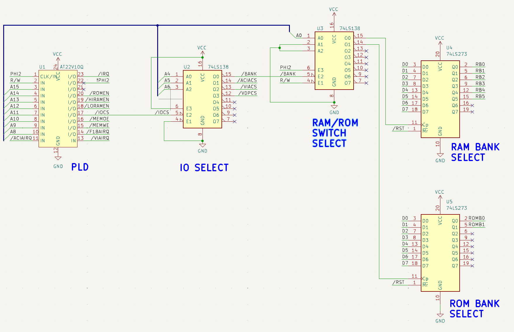

# Memory Address Decoder Logic

The AT22V10C PLD is used to arbitatrate the control signals to the various
memory and other devices in the computer.

```
              ______________
             |6502-Retro!  -|
    PHI2 x---|1           24|---x Vcc
      RW x---|2           23|---x IRQB
     A15 x---|3           22|---x
     A14 x---|4           21|---x
     A13 x---|5           20|---x ROMEN
     A12 x---|6           19|---x HIRAMEN
     A11 x---|7           18|---x LOWRAMEN
     A10 x---|8           17|---x IOCS
      A9 x---|9           16|---x MEMOE
      A8 x---|10          15|---x MEMWE
ACIAIRQB x---|11          14|---x F18AIRQB
     GND x---|12          13|---x VIAIRQB
             |______________|
```

## Bank Select Logic



The PLD sets the input signals to the memory devices themselves (not shown on
this diagram - see the full )as well as the
bank registers.  The Bank registers are selected first by the IO SELECT
Demultiplexer and then by the RAM/ROM Switch Demultiplexer.

A write 0x9F00 will be latched into the RAM Bank Register which is hardwired to
the upper address pins on the extended memory SRAM IC.

A write 0x9F01 will be latched into the ROM Bank Register which is hardwired to
the upper address pins on the Flash ROM.

### ROM Bank Switching

Care must be taken to ensure that software does not rely on routines in ROM
banks that are not current.  Typically, software in other ROM Banks uses a local
memory resident routine to wrap function calls to routines in differnt banks
such that the stack is properly preserved etc.  There is an example of how that
works in the ehBasic ROM.

### RAM Bank Switching

Bank 0 is used by the 6502-Retro! OS for the vaious buffers needed to manage the
SDCard and user input.

The extended memory is used mostly for data.  There is a special invocation of
the XModem Tool on BANK 0 that you can use to load large files into the extended
memory.  The tool begins loading data into BANK 1 and will fill up as many banks
as required to complete the load.

